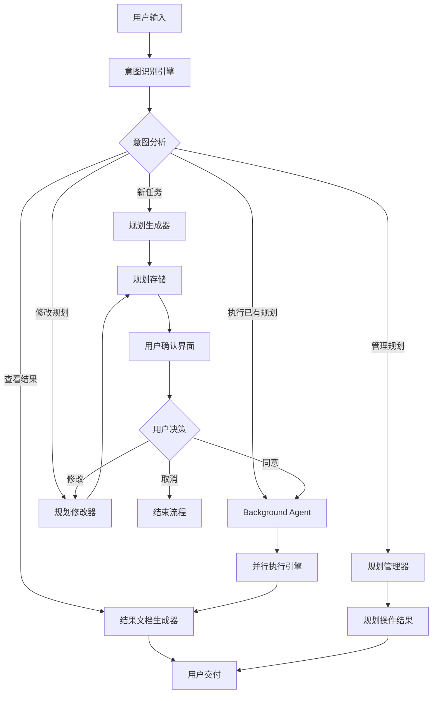

# Background Agent 人机协作并行工作流

## 概述

Background Agent(简称BGA) 是一个智能协作系统，旨在实现人与AI Agent之间的高效并行工作流。通过结构化的任务规划、确认机制和执行流程，确保任务的准确性和可追溯性。

## 工作流触发条件

### 1. 关键词触发
用户输入包含以下任一关键词时自动触发工作流：

**主要触发词**：
- `BGA` / `bga` - 直接引用Background Agent
- `Background Agent` - 完整名称
- `后台代理` / `后台助手` - 中文名称

**动作触发词**：
- `执行` + 规划编号（如"执行P001"）
- `运行` + 规划编号（如"运行P002"）
- `启动` + 规划编号（如"启动P003"）

**查询触发词**：
- 规划编号 + `状态`/`进度`/`结果`（如"P001状态"、"P002进度"）
- `查看` + 规划编号（如"查看P001"）

### 2. 上下文触发
即使未明确提及BGA，以下情况也会触发工作流：

**任务规划场景**：
- 用户描述复杂的多步骤任务
- 包含"帮我规划"、"制定计划"等表述
- 任务描述超过3个独立步骤

**批量处理场景**：
- 涉及大量文件或数据处理
- 包含"批量"、"自动化"、"并行"等关键词
- 需要长时间执行的任务

**项目管理场景**：
- 包含时间规划、资源分配的描述
- 涉及多个文件或模块的操作
- 需要生成报告或文档的任务

### 3. 智能识别机制

系统通过以下方式进行智能判断：

**任务复杂度分析**：
- 步骤数量：≥3个独立步骤
- 预估时间：≥5分钟的执行时间
- 文件操作：涉及≥5个文件的操作

**语义分析**：
- 识别任务分解需求
- 检测并行执行可能性
- 判断是否需要状态跟踪

**用户意图强度**：
- 明确的执行指令（高优先级触发）
- 探索性询问（低优先级触发）
- 紧急任务标识（立即触发）

### 4. 触发示例

#### ✅ 会触发工作流的输入示例：

**直接触发**：
- "BGA执行P001"
- "用Background Agent帮我处理这个任务"
- "P002的执行状态如何？"

**上下文触发**：
- "帮我批量处理这100个文件，需要先分析格式，然后转换，最后生成报告"
- "我要做一个复杂的数据迁移项目，包括备份、转换、验证、部署等步骤"
- "制定一个自动化测试计划，涵盖单元测试、集成测试和性能测试"

**智能识别触发**：
- "分析所有用户数据，生成季度报告，并发送给各部门负责人"
- "重构整个项目结构，更新依赖，修复已知bug，并更新文档"

#### ❌ 不会触发工作流的输入示例：

**简单查询**：
- "什么是Background Agent？"
- "如何使用BGA？"

**单步任务**：
- "帮我写个Hello World程序"
- "查看某个文件的内容"

**普通对话**：
- "今天天气怎么样？"
- "解释一下这个概念"

### 5. 触发优先级与处理策略

#### 触发优先级（从高到低）：

**Level 1 - 立即触发**：
- 明确包含BGA关键词的指令
- 指定规划编号的执行/查询请求
- 标记为紧急的任务

**Level 2 - 高优先级触发**：
- 复杂多步骤任务描述
- 批量处理需求
- 项目管理场景

**Level 3 - 智能判断触发**：
- 基于任务复杂度分析
- 语义分析结果
- 上下文相关性评估

#### 处理策略：

**确认机制**：
- Level 1：直接执行，无需额外确认
- Level 2：简要确认后执行
- Level 3：详细确认用户意图后决定是否触发

**误触发保护**：
- 提供"这不是我想要的"快速退出选项
- 支持触发后的流程中断
- 记录用户反馈以优化识别算法

## 工作流程

### 1. 用户意图识别

系统首先对用户的输入进行深度分析，识别用户的真实意图和需求：

- **语义理解**：解析用户描述中的关键信息
- **目标提取**：明确用户希望达成的具体目标
- **约束条件识别**：识别任务执行中的限制条件和要求
- **优先级判断**：评估任务的紧急程度和重要性

#### 意图识别后的流程分支

根据用户意图的不同，系统会智能选择进入相应的流程：

**1. 新任务规划**
- **触发条件**：用户描述新的需求或任务，且未指定现有规划编号
- **关键词识别**：包含任务描述、目标设定等内容
- **流程路径**：进入流程2（生成带编号的规划）

**2. 执行已有规划**
- **触发条件**：用户明确提到规划编号（如"执行P001"、"BGA P002"）
- **前置验证**：检查规划是否存在、状态是否允许执行
- **流程路径**：通过验证后直接进入流程4（Background Agent执行）

**3. 查看执行结果**
- **触发条件**：用户询问规划状态或执行结果（如"P001执行情况"、"查看P002报告"）
- **关键词识别**：状态查询、结果查看、报告查询等
- **流程路径**：直接进入流程5/6（结果文档查看/交付）

**4. 修改现有规划**
- **触发条件**：用户要求调整已有规划（如"修改P001"、"调整P002的任务3"）
- **前置验证**：检查规划是否存在、是否正在执行中
- **流程路径**：进入流程3A（规划修改确认机制）

**5. 规划管理**
- **触发条件**：列出规划、删除规划、重命名规划等管理操作
- **关键词识别**：列出、删除、查看所有、管理等
- **流程路径**：直接操作todos文件夹并返回结果

### 2. 生成带编号的规划并保存（仅限新任务）

基于用户意图，系统生成详细的执行规划：

#### 规划内容包括：
- **任务分解**：将复杂任务拆分为可执行的子任务
- **执行顺序**：确定任务的先后依赖关系
- **资源需求**：明确所需的工具、数据和权限
- **预期产出**：定义每个阶段的交付物

#### 存储结构：
```
todos/
├── P001/
│   ├── plan.json
│   ├── todolist.md
│   ├── rationale.md
│   ├── user_feedback.md
│   └── reports/
│       ├── exec_001_2024-01-15_14-30.md
│       ├── exec_002_2024-01-16_09-15.md
│       └── logs/
│           ├── exec_001/
│           │   ├── detailed_log.log
│           │   └── error_log.log
│           └── exec_002/
│               ├── detailed_log.log
│               └── error_log.log
├── P002/
│   ├── plan.json
│   ├── todolist.md
│   ├── rationale.md
│   ├── user_feedback.md
│   └── reports/
└── P003/
    ├── plan.json
    ├── todolist.md
    ├── rationale.md
    └── user_feedback.md
```

#### 编号规则：
- **格式**: P + 3位数字 (P001, P002, P003...)
- **简单易记**: 从P001开始顺序递增
- **便于引用**: 用户只需记住简短的编号如"P001"

#### 文件内容：
- **plan.json**: 规划的完整配置和元数据
- **todolist.md**: 包含编号的具体任务清单，会根据执行情况实时更新状态
- **rationale.md**: 详细说明每个任务的执行理由和逻辑
- **user_feedback.md**: 用户对规划的建议、修改意见和反馈记录
- **reports/**: 执行报告文件夹，记录每次执行的结果

#### 任务状态管理：
todolist.md使用标准的任务状态标记，**执行过程中必须严格按规则更新**：

```markdown
## 任务清单

- [ ] 1. 任务名称 - 待执行
- [x] 2. 任务名称 - 已完成
- [!] 3. 任务名称 - 执行失败
- [~] 4. 任务名称 - 执行中
- [-] 5. 任务名称 - 已跳过

### 状态说明：
- [ ] : 待执行 (pending)
- [x] : 已完成 (completed)
- [!] : 执行失败 (failed)
- [~] : 执行中 (in_progress)
- [-] : 已跳过 (skipped)
```

#### 强制状态更新要求：
1. **任务开始时**：**必须**直接编辑todolist.md文件将状态更新为`[~]`（执行中）
2. **任务完成时**：**必须**直接编辑todolist.md文件将状态更新为`[x]`（已完成）或`[!]`（执行失败）
3. **实时同步**：todolist.md中的任务状态**必须**与实际执行进度保持同步
4. **状态验证**：执行结束前**必须**验证todolist.md中所有任务状态已正确更新

#### 状态跟踪方法（todo_write工具定义）：
`todo_write`是指直接编辑文件的操作，具体实现方式：
- **工具选择**：使用`edit_file`或`search_replace`工具直接修改todolist.md文件
- **状态标记规范**：
  - `[ ]` → `[~]`：任务开始执行时的状态变更
  - `[~]` → `[x]`：任务成功完成时的状态变更  
  - `[~]` → `[!]`：任务执行失败时的状态变更
- **精确定位**：通过任务编号和内容精确定位需要更新的任务行
- **原子操作**：每次只更新一个任务的状态，确保操作的原子性

#### 多次执行管理：
- **执行报告命名**: exec_序号_日期时间.md (如: exec_001_2024-01-15_14-30.md)
- **日志分离**: 每次执行的日志单独存储在logs/exec_序号/文件夹中
- **版本追踪**: 支持同一规划的多次执行和结果对比
- **状态更新**: 每次执行时实时更新todolist.md中的任务状态
- **状态记录**: 记录每次执行的成功/失败状态和详细信息

#### 执行报告自动生成强制要求：
1. **报告文件必须创建**：执行完成后**必须**创建`exec_序号_YYYY-MM-DD_HH-mm.md`格式的报告文件
2. **完整状态记录**：报告中**必须**包含所有任务的状态变更历史
3. **工具调用记录**：**必须**记录所有使用的工具和执行结果
4. **时间戳记录**：**必须**记录每个任务的开始和完成时间
5. **验证检查点**：报告末尾**必须**包含对todolist.md状态更新的验证确认

#### 报告模板格式：
```markdown
# 规划执行报告 - exec_001_YYYY-MM-DD_HH-mm

## 执行概览
- **规划ID**: P00X
- **执行开始时间**: YYYY-MM-DD HH:mm:ss
- **执行结束时间**: YYYY-MM-DD HH:mm:ss
- **总耗时**: X小时Y分钟
- **任务总数**: X个
- **完成任务**: X个
- **失败任务**: X个

## 任务状态变更历史
### 任务1: [任务名称]
- 开始时间: YYYY-MM-DD HH:mm:ss - 状态: pending → in_progress
- 完成时间: YYYY-MM-DD HH:mm:ss - 状态: in_progress → completed
- 执行结果: [具体结果描述]

## 工具调用记录
[记录所有工具调用和结果]

## todolist.md状态验证
✅ 所有任务状态已更新完成
- Task 1: [x] 已完成
- Task 2: [x] 已完成
...
```

### 3. 用户确认机制（新建规划时）

将生成的新规划发送给用户进行审核确认：

#### 确认内容：
- **任务列表审查**：用户检查任务分解是否合理
- **执行顺序确认**：验证任务依赖关系的正确性
- **资源配置同意**：确认所需资源的可用性
- **预期结果对齐**：确保产出符合用户期望

#### 确认方式：
- 系统发送规划摘要和详细计划
- 用户可以：
  - 完全同意并授权执行
  - 提出修改建议（记录在user_feedback.md中）
  - 调整优先级或执行顺序
  - 取消或暂停特定任务

#### 用户建议记录：
- **user_feedback.md**: 专门记录用户对规划的建议和反馈
- **内容包括**：
  - 用户对任务分解的修改建议
  - 执行顺序的调整意见
  - 资源配置的改进建议
  - 预期结果的补充说明
  - 执行过程中的注意事项
- **格式**：按时间顺序记录，包含建议类型、具体内容和处理状态

#### user_feedback.md 格式示例：
```markdown
# 用户反馈记录

## 初始规划反馈
**时间**: 2024-01-15 10:30  
**类型**: 任务分解修改  
**状态**: 已采纳  
**内容**: 建议将任务3拆分为两个子任务，提高执行效率  
**处理结果**: 已在todolist.md中更新任务分解  

## 执行过程反馈
**时间**: 2024-01-15 14:20  
**类型**: 执行顺序调整  
**状态**: 处理中  
**内容**: 建议优先执行任务5，因为其输出是任务7的前置条件  
**处理结果**: 待下次执行时调整顺序  

## 结果改进建议
**时间**: 2024-01-16 09:15  
**类型**: 输出格式优化  
**状态**: 已记录  
**内容**: 建议在报告中增加可视化图表，便于理解执行效果  
**处理结果**: 已加入下个版本的改进计划  
```

### 3A. 规划修改确认机制（仅限修改现有规划）

针对现有规划的修改需要专门的确认流程：

#### 修改前验证：
- **规划存在性检查**：确认要修改的规划确实存在
- **执行状态检查**：确认规划当前未在执行中
- **权限验证**：确认有权限修改该规划

#### 修改内容类型：
- **任务调整**：添加、删除、修改特定任务
- **顺序调整**：改变任务执行顺序
- **参数修改**：调整任务参数或配置
- **资源更新**：修改所需资源配置

#### 修改确认流程：
- 显示当前规划内容
- 明确标出要修改的部分
- 生成修改对比视图
- 用户确认修改内容
- 更新规划文件并记录修改历史

### 4. Background Agent 执行（执行已确认或现有规划）

根据不同情况启动Background Agent执行：

#### 执行前验证：
- **规划有效性检查**：确认规划文件完整且格式正确
- **依赖关系验证**：检查任务间的依赖关系是否合理
- **资源可用性检查**：确认所需资源当前可用
- **冲突检测**：检查是否与其他正在执行的规划冲突

#### 执行类型：
- **新规划首次执行**：用户确认后的首次执行
- **已有规划直接执行**：使用规划编号直接执行
- **重新执行**：重复执行同一规划（生成新的执行记录）
- **部分执行**：只执行规划中的特定任务

#### 执行特点：
- **并行处理**：支持多任务同时执行（需要处理任务间依赖）
- **实时监控**：跟踪执行状态和进度
- **状态同步**：**必须**在每个任务开始时将todolist.md中的状态更新为`[~]`（执行中），完成时更新为`[x]`（已完成）或`[!]`（执行失败）
- **任务状态跟踪**：**强制要求**使用直接文件编辑（`todo_write`）实时更新任务状态，确保todolist.md反映当前执行进度
- **错误处理**：自动处理异常情况并记录，支持失败任务的重试
- **资源管理**：优化系统资源使用，避免资源冲突
- **并发控制**：防止同一规划被多次同时执行

#### 执行命令示例：
```bash
# 首次执行（带验证）
bga execute --plan-id=P001 --mode=parallel --validate

# 重新执行同一规划（会生成新的执行报告）
bga execute --plan-id=P001 --mode=parallel --retry

# 部分执行（只执行特定任务）
bga execute --plan-id=P001 --tasks=1,3,5 --mode=parallel

# 强制执行（跳过某些验证，谨慎使用）
bga execute --plan-id=P002 --mode=parallel --force

# 查看执行状态
bga status --plan-id=P001

# 停止执行
bga stop --plan-id=P001
```

### 5. 执行结果文档生成（自动触发或按需查看）

**强制要求**：任务执行完毕后**必须**自动生成标准格式的执行报告，或用户主动查询执行结果时提供详细的说明文档：

#### 强制执行的文档生成要求：
1. **执行报告必须生成**：每次执行完成后，**必须**在`reports/`文件夹中生成`exec_序号_日期时间.md`格式的报告
2. **todolist.md状态必须更新**：**必须**将所有已完成任务的状态从`[ ]`更新为`[x]`
3. **实时状态记录**：执行过程中**必须**记录每个任务的状态变更历史

#### 文档内容：
- **执行摘要**：任务完成情况概览，包含具体的完成/失败统计
- **任务状态变更历史**：详细记录todolist.md中每个任务状态的完整变更过程（pending→in_progress→completed/failed）
- **详细日志**：每个步骤的执行记录和工具调用记录
- **产出清单**：生成的文件、数据和结果的完整清单
- **问题记录**：执行过程中遇到的问题和解决方案
- **性能指标**：执行时间、资源消耗、工具调用次数等数据
- **后续建议**：基于执行结果的改进建议
- **状态验证**：确认todolist.md已正确更新所有任务状态

#### 文档格式：
```
todos/P001/reports/
├── exec_001_2024-01-15_14-30.md      # 第一次执行报告
├── exec_002_2024-01-16_09-15.md      # 第二次执行报告
└── logs/
    ├── exec_001/
    │   ├── detailed_log.log
    │   ├── error_log.log
    │   └── outputs/
    │       ├── generated_files/
    │       └── data_exports/
    └── exec_002/
        ├── detailed_log.log
        ├── error_log.log
        └── outputs/
            ├── generated_files/
            └── data_exports/

```

### 6. 结果交付（按需提供或主动推送）

根据不同场景向用户提供执行结果：

- **主动推送**：任务完成后立即通知用户并提供报告
- **按需查询**：用户主动询问时提供相应的执行报告
- **实时状态**：用户随时可查询任何规划的执行状态
- **结果验证**：支持用户对结果进行验证
- **反馈收集**：收集用户对执行效果的反馈

## 优势特点

### 透明可控
- 完整的规划确认流程
- 详细的执行日志记录
- 可追溯的决策过程

### 高效协作
- 人机分工明确
- 并行执行提升效率
- 减少重复沟通成本

### 质量保障
- 多层次的确认机制
- 实时的任务状态跟踪
- 自动化的错误处理
- 标准化的输出格式

### 灵活适应
- 支持计划调整和修改
- 适应不同复杂度的任务
- 可配置的执行策略

## 使用场景

- **项目管理**：复杂项目的规划和执行
- **数据处理**：大规模数据分析和处理任务
- **内容创作**：多媒体内容的批量生成
- **系统维护**：自动化运维任务执行
- **研究分析**：深度研究和分析工作

## 注意事项

### 执行安全
1. **权限管理**：确保Agent具备必要的执行权限，遵循最小权限原则
2. **安全考虑**：执行过程中的安全风险评估，避免危险操作
3. **备份机制**：重要数据和结果需要及时备份

### 系统稳定性
4. **资源监控**：注意系统资源的使用情况，避免资源耗尽
5. **并发控制**：防止同一规划被多次同时执行，避免状态冲突
6. **错误恢复**：建立完善的错误处理和恢复机制

### 数据一致性
7. **版本控制**：规划和结果的版本管理，支持回滚操作
8. **文件同步**：保持user_feedback.md与实际执行计划的同步
9. **状态管理**：确保任务状态更新的原子性和一致性

### 用户体验
10. **用户反馈及时性**：确保用户反馈能够及时记录和处理
11. **执行结果的验证**：确保执行结果符合用户期望
12. **获取正确的时间**：调用合适的工具以确保获取正确的时间
13. **意图识别准确性**：提高用户意图识别的准确性，减少误操作

## 技术架构



此工作流确保了人与AI Agent之间的高效协作，通过标准化的流程和完善的确认机制，实现了任务执行的可控性和高质量的结果交付。 